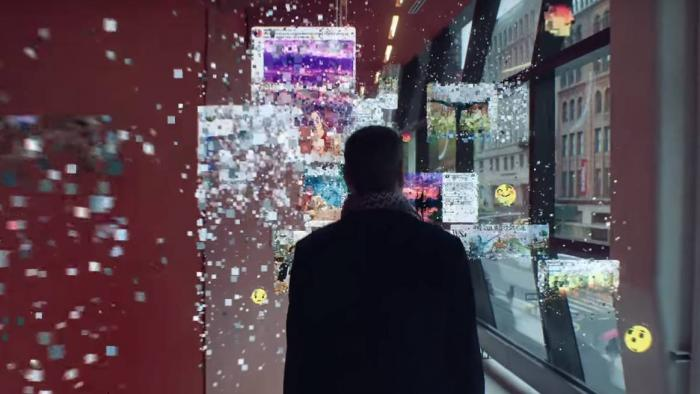
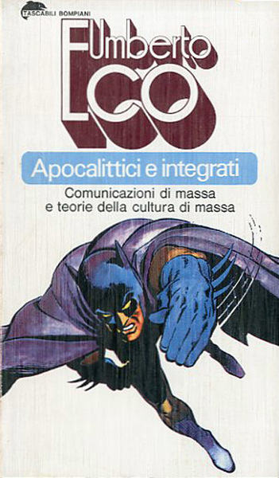
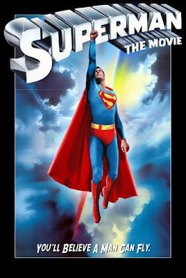
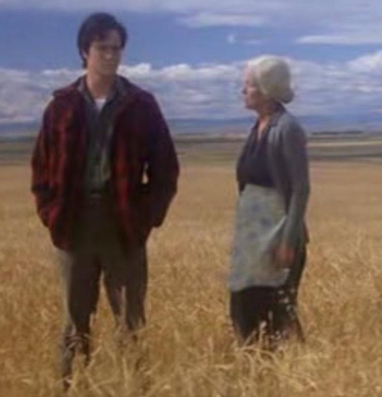
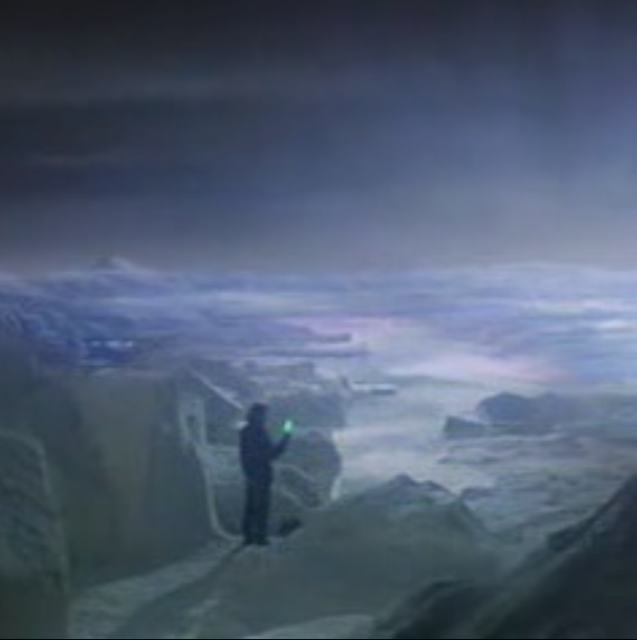
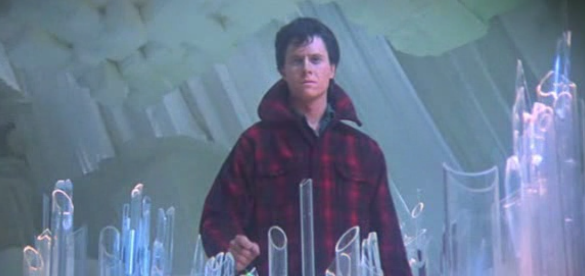
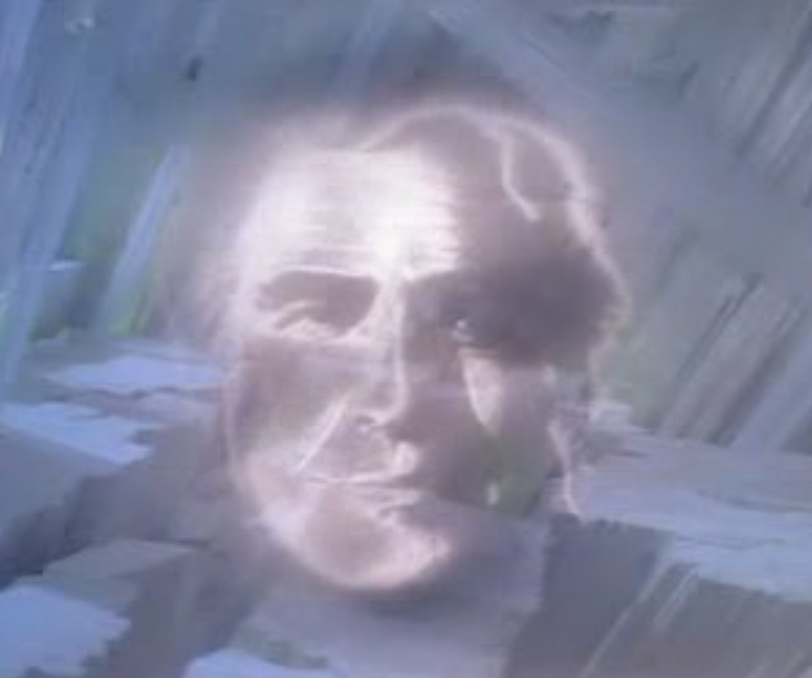
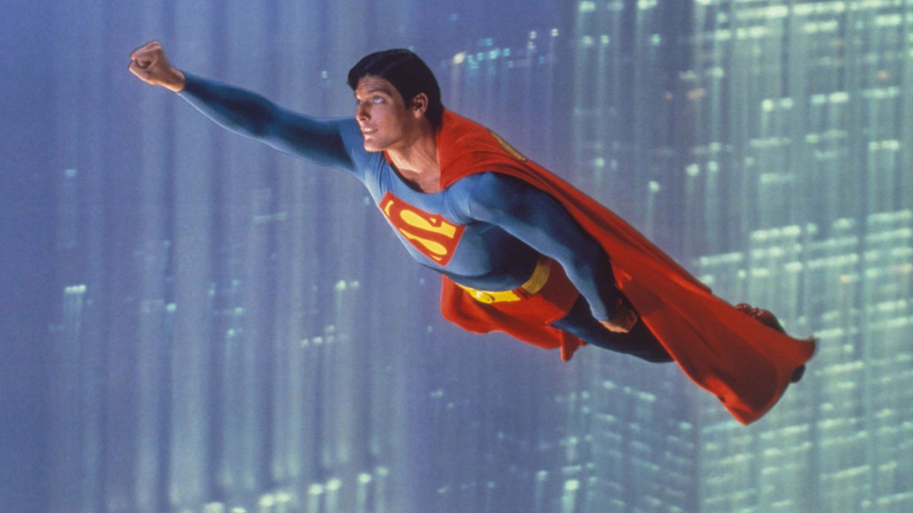
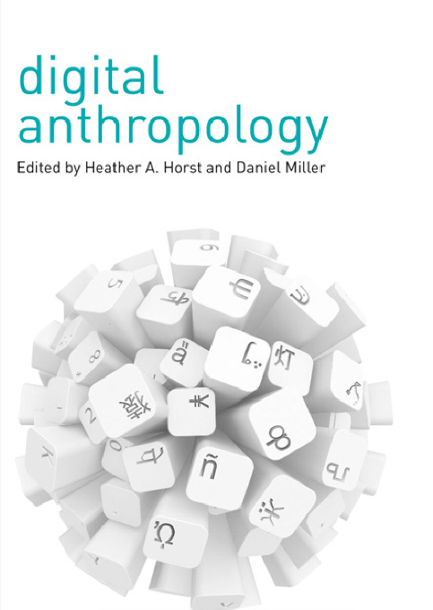

layout: true

```{r setup, include=FALSE}
options(htmltools.dir.version = FALSE)

knitr::opts_chunk$set(
	echo = FALSE,
	fig.align = "center",
	message = FALSE,
	warning = FALSE,
	cache = FALSE
)
```

```{r eval=FALSE, include=FALSE}
library(knitr)
library(tidyverse)
library(widgetframe)
```
---
class: middle, center  

# Leonardo F. Nascimento

```{r out.width="25%"}
knitr::include_graphics("img/logos_bia.png")
```

## 15% Programador, 20% Químico, 25% Psicólogo, 40% Cientista Social
<br>

### [Email: **leofn3@gmail.com**](mailto:leofn3@gmail.com) 

### [Twitter:**@leofn3**](http://www.twitter.com/leofn3) 

### [website: **www.leofn.com**](http://www.leofn.com)

---
class: middle, center  

```{r, out.width="50%"}
knitr::include_graphics("img/logo_MA_color.png")
```

## Laboratório de Humanidades Digitais da UFBA

**Twitter**: [@labhdufba](https://twitter.com/labhdufba) 
<br>
**Instagram**: [@labhdufba](http://instagram.com/labhdufba)
<br>
**Github**: [https://github.com/LABHDUFBA](https://github.com/LABHDUFBA)
<br>
**Youtube**: [https://www.youtube.com/c/LABHDUFBA](https://www.youtube.com/c/LABHDUFBA)

---
class: inverse, middle, center
background-image: url("img/4.png")
background-size: contain

---
class: inverse, middle, center
background-image: url("img/2.png")
background-size: contain

---
class: inverse, middle, center
background-image: url("img/3.png")
background-size: contain

---
class: inverse, center, middle

--
## As tecnologias digitais constituem uma experiência *sui generis* nas sociedades contemporâneas?
<br>

--
## A forma de produção do conhecimento em Filosofia foi alterada por conta destas tecnologias?
<br>

--
## O que pretende uma Filosofia Digital e/ou uma Filosofia do Digital?
<br>


---
class: inverse, center, middle

# Aspectos gerais das sociedades contemporâneas...

---
class: inverse, middle, center

## "Digitalização do eu na vida cotidiana" (Nascimento, 2020)

```{r, out.width="200%"}
knitr::include_graphics("img/ds.jpeg")
```
---
class: inverse, center, middle

## Algoritmização de processos sociais

```{r, out.width="80%"}
knitr::include_graphics("img/matrix-digital-self.png")
```

---
class: inverse, center, middle

## Traços digitais (Howison et al. 2011, p. 769)


```{r, out.width="200%"}

```

---
class: inverse, center, middle

## Dataficação (Cukier & Mayer-Schoenberger, 2013)

```{r, out.width="200%"}

```

---
class: inverse, center, middle

## Cultura de vigilância (Lyon, 2018)


```{r, out.width="200%"}
knitr::include_graphics("img/surv.jpg")
```

---
class: inverse, center, middle

# A forma de produção do conhecimento em Filosofia foi alterada por conta das tecnologias digitais?

```{r, out.width="100%"}
knitr::include_graphics("https://media.giphy.com/media/pOEbLRT4SwD35IELiQ/giphy.gif?cid=ecf05e475vot0dyqf7ocbyf43eh75omn2pjcymz4m65rzbf4&rid=giphy.gif&ct=g")
```
---
class: inverse, middle, center

# Argumentação (intelectual e Nerd!)

.pull-left[
```{r, out.width="70%"}

```
]
.pull-right[
```{r, out.width="85%"}

```
]

---
class: inverse, middle, center

# Morte do pai e ida ao norte

.pull-left[
```{r, out.width="100%"}

```
]
.pull-right[
```{r, out.width="90%"}

```
]

---
class: inverse, middle, center

# Dispositivo de tubos e cristais (arquivo).

```{r, out.width="200%"}

```

---
class: inverse, middle, center

# Fantasma Jor-el e o conhecimento de 28 galáxias

.pull-left[
```{r, out.width="150%"}

```
]
.pull-right[
```{r, out.width="100%"}
knitr::include_graphics("https://media.giphy.com/media/sJvz8Qnfly3BOuotGx/giphy-downsized-large.gif")
```
]

---
class: inverse, middle, center

# Após 12 anos (<s>de graduação!</s>) uma cena marcante!

```{r, out.width="200%"}

```
---
class: center, middle

## O dispositivo de cristal ou "arquivo” proporcionou ao personagem saber seu nome, as circunstâncias da separação familiar, a história de seu povo e das diversas galáxias. Ou seja, toda a possibilidade de conhecimento indexada nos cristais permitiu, de uma só vez, a reconstrução do seu passado, a constituição de sua identidade heróica e o estabelecimento do seu papel da Terra" 

(Nascimento, L. Do codex ao autocoding, 2017 - manuscrito não publicado)

---
class: inverse, center, middle

# A matéria que possibilita a **reflexão filosófica** é (ainda que não exclusiva, mas preponderantemente) o **legado textual**. 


```{r, out.width="100%"}
knitr::include_graphics("https://media.giphy.com/media/128MHrlrHNwwU0/giphy.gif")
```
]

---
class: inverse, middle, center

# A possibilidade de **acessar e recuperar textos, conceitos, autores e suas relações de maneira veloz e sistemática** é fundamental para a reflexão filosófica e (*pode alterar o modo como ele a própria filosofia é realizada!*)

---
class: inverse, center, middle

# Nós precisamos de uma **antropologia digital**?

---
class: center, middle

```{r, out.width="45%"}

```

### "..o digital, como toda cultura material, é mais do que um substrato; está se tornando parte constitutiva do que nos torna humanos" 
##### (Heather & Miller. Digital Anthropology. Taylor & Francis,  2013, p.4)

---
class: inverse, center, middle

## O que pretende uma **Filosofia Digital** e/ou uma **Filosofia do Digital**?

---
class: middle, center

--
## 1  Digital como **objeto de reflexão** da Filosofia;
<br>

--
## 2. Digital como **forma de produção do conhecimento** filosófico;
<br>

---
class: middle, center

# **Objeto de reflexão**
<br>

--
## Inteligência artificial
<br>

--
## Realidade virtual e aumentada
<br>

--
## Bots e "assistentes"
<br>

--
## Problemas éticos e morais
<br>

--
## blabla
<br>

---
class: middle, center

# **Forma de produção do conhecimento filosófico**
<br>

--
## Letramento digital
<br>

--
## Articulação analógico e digital
<br>

--
## Text as data
<br>

--
## Sistematicidade e formas revolucionárias de arquivamento
<br>

--
## Cuidado com o soterramento! (download *versus* capacidade analítica)
---
class: inverse, center, middle

# Para finalizar: como eu aprendo a fazer **Filosofia (do) Digital**?

---
class: middle, center

## Obrigado gente!

.pull-left[
```{r, out.width="70%"}
knitr::include_graphics("https://media.giphy.com/media/R8MIGe47XWx68/giphy.gif")
```
]
.pull-right[
##**Agradecimentos especiais**:
<br>

### Marcos Fanton - Bruno Pinheiro Costa - CodeQ UFSM
<br>

]

